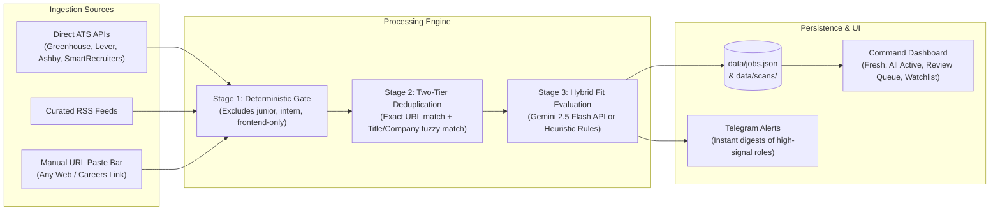

# GEMINI.md - JobAppy Assist Project Context

## 1. Project Mission & Overview

**JobAppy Assist** is a high-precision, automated career intelligence and job discovery portal calibrated for senior distributed systems and AI engineers.

Instead of scraping fragile aggregator websites, the platform connects directly to public employer ATS APIs (Greenhouse, Lever, Ashby, SmartRecruiters), high-signal RSS feeds, and on-demand target job URLs. Postings undergo multi-stage deterministic filtering, deduplication, and LLM-powered candidate fit evaluation (Gemini 2.5 Flash with heuristic fallback) before presenting actionable opportunities in a real-time command dashboard.

---

## 2. Calibrated Candidate Profile

The evaluation engine is calibrated against the candidate profile defined in `data/profile.json`:

* **Candidate:** Manish Kumar Prajapati
* **Experience:** ~8.5+ Years
* **Current Role:** Software Engineer (Advanced) at Amdocs
* **Core Domains:**
  * Distributed Systems & High-Throughput Microservices
  * CRM SaaS Architecture (millions of users, 40% latency reduction)
  * AI Agent Orchestration & LLMs (Smriti: zero-fabrication companion, vector embeddings, cosine similarity)
* **Core Technologies:**
  * **Languages:** Java, Python, TypeScript/JavaScript, SQL
  * **Frameworks & Backend:** Spring Boot, FastAPI, Node.js, Express
  * **Streaming & Messaging:** Apache Kafka, Event-Driven Architecture, Pub/Sub
  * **Databases & Storage:** PostgreSQL, MySQL, Redis, Vector DBs
  * **Cloud & DevOps:** AWS (S3, RDS, EC2), Docker, Kubernetes, CI/CD
* **Target Roles:** Staff Software Engineer, Principal Engineer, Lead Engineer, Senior Backend Engineer, Distributed Systems Architect, AI Systems Engineer
* **Target Locations & Compensation:**
  * **Locations:** Remote (Worldwide / India) or Relocation to Japan (Tokyo) / South Korea (Seoul)
  * **Target Compensation:** INR 35–65 LPA (Min INR 35L)

---

## 3. Technology Stack & Tooling

* **Framework:** Next.js 14.2 (App Router)
* **Language:** TypeScript 5.5
* **Package Manager:** `pnpm` 11.8+ (enforced via `packageManager` in `package.json`)
* **Styling & UI:** Tailwind CSS 3.4, Lucide React icons, Framer Motion
* **HTML & Feed Parsing:** Cheerio 1.2+ (for on-demand job URL extraction), RSS-Parser
* **AI Evaluation:** Gemini 2.5 Flash API (`https://generativelanguage.googleapis.com`) with intelligent heuristic rules fallback
* **Storage & Persistence:** Local JSON store (`data/jobs.json`, `data/companies.json`, `data/profile.json`, `data/scans/`) with Drizzle ORM schema ready for PostgreSQL / Neon database integration.

---

## 4. System Architecture & Ingestion Pipeline



### Ingestion Details
1. **Direct ATS Adapters (`lib/ats-adapters.ts`):**
   * Greenhouse: `https://boards-api.greenhouse.io/v1/boards/{slug}/jobs?content=true`
   * Lever: `https://api.lever.co/v0/postings/{slug}?mode=json`
   * Ashby: `https://api.ashbyhq.com/posting-api/job-board/{slug}`
   * SmartRecruiters: `https://api.smartrecruiters.com/v1/companies/{slug}/postings`
2. **On-Demand URL Evaluator (`app/api/eval/url/route.ts` & `lib/url-evaluator.ts`):**
   * Automatically parses known ATS endpoints or scrapes public job web pages using Cheerio.
   * Extracts clean job title, company name, location, and description text.
   * Runs through the evaluation pipeline in real-time and computes match percentage score (0-100%).
3. **Two-Tier Deduplication (`lib/dedup.ts`):**
   * **Level 1 (Exact URL Match):** Merges multi-source sightings into a single canonical entry, updating evidence quotes.
   * **Level 2 (Fuzzy Title & Company Match):** Flags overlapping postings in the Review Queue for candidate review (`merge` vs `confirm_distinct`).
4. **AI Evaluator (`lib/ai-evaluator.ts`):**
   * Evaluates seniority, tech stack overlap, remote compatibility, and visa sponsorship potential.
   * Returns calibrated score (0–100), executive rationale, evidence quotes, and key concerns.
5. **Top 50 Distinct Company Openings Engine (`app/api/jobs/route.ts` & `app/page.tsx`):**
   * Groups active candidate-matched postings by employer (`?distinct=true&minScore=65&limit=50`).
   * Selects the single highest-scoring opening as the representative hero card for each company.
   * Provides an interactive accordion displaying `+N other roles at this company` with individual fit scores and apply links.
   * Sorted descending by candidate relevance score (100 -> 65), tie-broken by posting recency.

---

## 5. Directory Structure

```
job-appy-assist/
├── app/
│   ├── api/
│   │   ├── companies/        # CRUD for employer watchlist
│   │   ├── cron/check-jobs/  # Scheduled cron ingestion hook
│   │   ├── eval/url/         # On-demand manual job URL evaluation
│   │   ├── jobs/             # Canonical job listing endpoint
│   │   ├── profile/          # Candidate profile fetch/update
│   │   ├── review/resolve/   # Duplicate resolution actions
│   │   ├── scan/manual/      # Trigger full watchlist live scan
│   │   ├── scans/            # Historical scan record retrieval
│   │   └── webhooks/         # External webhook broadcast ingestion
│   ├── globals.css           # Tailwind & cyber-aesthetic design tokens
│   ├── layout.tsx            # App shell
│   └── page.tsx              # Main interactive glassmorphic dashboard
├── data/
│   ├── companies.json        # Tracked employer configurations & slugs
│   ├── jobs.json             # Canonical active and reviewed jobs store
│   ├── profile.json          # Candidate profile configuration
│   └── scans/                # Historical snapshot audits & rate limits
├── lib/
│   ├── ai-evaluator.ts       # Gemini 2.5 Flash API + Heuristic scoring
│   ├── ats-adapters.ts       # Greenhouse, Lever, Ashby, SmartRecruiters, RSS
│   ├── dedup.ts              # Two-tier URL and title fuzzy deduplication
│   ├── storage.ts            # Atomic file read/write utilities
│   ├── telegram.ts           # Telegram bot alerting integration
│   └── url-evaluator.ts      # URL extraction and single-posting evaluator
├── scripts/
│   └── scheduler.ts          # Standalone background polling worker
├── GEMINI.md                 # Project context & architecture reference
├── package.json              # Project dependencies & scripts
├── pnpm-lock.yaml            # pnpm lockfile
└── tsconfig.json             # TypeScript configuration
```

---

## 6. Development & Command Reference

All commands must be executed using `pnpm`:

```bash
# Install dependencies
pnpm install

# Start local Next.js dev server (http://localhost:3000)
pnpm dev

# Build production bundle
pnpm build

# Run Next.js production server
pnpm start

# Run ESLint validation
pnpm lint

# Trigger a one-time full scan across tracked ATS companies & feeds
pnpm scan

# Run continuous background worker polling daemon
pnpm worker
```

---

## 7. Environment Variables

Create a `.env.local` file with the following keys if enabling external AI or live notifications:

```env
# Optional: Gemini API Key for semantic candidate-job matching
GEMINI_API_KEY=your_google_ai_gemini_key

# Optional: Local Ollama fallback
USE_OLLAMA=false
OLLAMA_HOST=http://localhost:11434

# Optional: Telegram bot notifications for fresh role alerts
TELEGRAM_BOT_TOKEN=your_telegram_bot_token
TELEGRAM_CHAT_ID=your_telegram_chat_id
```
*(If no API keys are provided, the system automatically uses the zero-dependency, calibrated heuristic engine without crashing.)*
