# High-Level Design (HLD) — Mock-Interview Voice Module

**Date:** 2026-09-21  
**Project:** JobAppy Assist — Architecture Specification  
**Status:** Approved for Implementation

---

## 1. System Architecture Overview

The system consists of three distinct tiers:
1. **Frontend Client (Next.js 14 Web App):** Runs in the candidate's browser, capturing mic audio via `AudioWorklet`, rendering the animated avatar, hosting the stripped-down Monaco editor and Excalidraw canvas, and playing incoming audio PCM chunks.
2. **Local Real-Time Proxy & Observer Server (`pnpm interview:server`):** Standalone TypeScript process on `127.0.0.1:4001` managing duplex WebSockets with the browser, streaming audio and text to/from Google Gemini Live API, hosting the Observer evaluation loop, and recording turns/events directly into SQLite.
3. **External Gemini Cloud Services:** Google Gemini Live API (bi-directional audio & transcription), Google Gemini Flash (Observer drift evaluation), and Google Gemini Pro (Post-interview rubric grading).

```mermaid
graph TD
    subgraph Browser ["Candidate Browser (Next.js 14 App Router)"]
        UI["Interview Room UI (/interview/[id])"]
        Robot["SVG Robot Avatar (RMS Audio Responsive)"]
        AudioIn["AudioWorklet (Mic 16kHz PCM Capture)"]
        AudioOut["AudioContext Playback (24kHz PCM + Barge-In)"]
        Monaco["Monaco C++ Editor (Stripped Autocomplete)"]
        Excalidraw["Excalidraw Diagramming Canvas"]
        DigestGen["Digest Generator (AST / Spatial Topology)"]
    end

    subgraph LocalProxy ["Local Server Process (interview:server :4001)"]
        WSServer["WebSocket Server (ws://127.0.0.1:4001)"]
        SessionMgr["Session Coordinator & Token Meter"]
        ResumptionHandler["Resumption & Context Sliding Mgr"]
        PolicyEngine["Deterministic Policy Engine (VAD / Cooldown)"]
        ObserverService["Observer Evaluator (Debounced 5-10s)"]
    end

    subgraph Storage ["Local Persistence Layer"]
        SQLite[("SQLite DB: data/job_appy.db")]
        Markdown["Markdown Dossiers: data/interviews/*.md"]
    end

    subgraph GoogleAI ["Google Gemini Cloud Platform"]
        LiveAPI["Gemini Live API (gemini-3.8-live / 2.5-flash)"]
        ObserverLLM["Gemini Flash (Drift & Stall Check)"]
        GraderLLM["Gemini Pro (Post-Session Rubric Grader)"]
    end

    %% Client to Proxy
    AudioIn -->|Binary PCM 16kHz| WSServer
    DigestGen -->|JSON Code/Diagram Digest| WSServer
    WSServer -->|Binary PCM 24kHz| AudioOut
    WSServer -->|Live Captions & State| UI
    AudioOut -.->|RMS Level| Robot

    %% Proxy to Gemini Live
    WSServer <-->|Bidi WSS / Audio & Text| LiveAPI
    SessionMgr -->|Query/Update Session & Usage| SQLite
    SessionMgr -->|Write Turn Transcript| SQLite

    %% Observer Flow
    DigestGen -.->|Digest Change Event| ObserverService
    ObserverService -->|Structured Prompt| ObserverLLM
    ObserverLLM -->|Drift/Status JSON| PolicyEngine
    PolicyEngine -->|Inject [INTERNAL-OBSERVER] probe| LiveAPI

    %% Grading Flow
    UI -->|End Session Event| SessionMgr
    SessionMgr -->|Full Transcript + Code + Diagram| GraderLLM
    GraderLLM -->|Rubric Scores & Evidence Quotes| SQLite
    GraderLLM -->|Generate Markdown Dossier| Markdown
```

---

## 2. End-to-End Session Sequence

```mermaid
sequenceDiagram
    autonumber
    actor Candidate
    participant Browser as Browser Client
    participant Proxy as Local WS Proxy (:4001)
    participant SQLite as SQLite DB
    participant Live as Gemini Live API
    participant Observer as Observer Service
    participant Grader as Gemini Pro Grader

    Candidate->>Browser: Selects "Google - System Design" & Clicks "Start Session"
    Browser->>Proxy: WS Handshake (sessionId, questionId, model)
    Proxy->>SQLite: Insert into interview_sessions (status: 'active')
    Proxy->>Live: Connect Live Session (System Prompt + Question + Transcription Config)
    Live-->>Proxy: Connection Established (resumption_handle)
    Live->>Proxy: Initial Spoken Turn ("Hello Manish, let's design...")
    Proxy->>Browser: Send Audio PCM (24kHz) + Transcript Captions
    Browser->>Candidate: Plays Audio & Displays Captions

    rect rgb(20, 30, 25)
    Note over Candidate, Live: Active Voice Dialogue Phase
    Candidate->>Browser: Speaks ("I will start by scoping requirements...")
    Browser->>Proxy: Streams PCM Audio (16kHz)
    Proxy->>Live: Forwards PCM Audio
    Live-->>Proxy: Streams Candidate Transcript & Model Spoken Response
    Proxy-->>Browser: Audio PCM + Captions
    Candidate->>Browser: Sketches Excalidraw blocks & types C++ in Monaco
    Browser->>Proxy: Sends digest (hash changed)
    Proxy->>Live: Sends low-priority [DIAGRAM-DIGEST] update
    end

    rect rgb(35, 25, 20)
    Note over Observer, Live: Observer Background Monitoring Phase
    Proxy->>Observer: Evaluates latest digest + last N turns
    Observer->>Proxy: Status: 'drifting', missing: ['traffic_spikes', 'backpressure']
    Proxy->>Proxy: Policy Check (Candidate silent >4s, Cooldown >90s) -> PASSED
    Proxy->>Live: Injects text: "[INTERNAL-OBSERVER] Ask about traffic surge handling."
    Live->>Proxy: Generates spoken probe ("What happens if traffic spikes 50x?")
    Proxy->>Browser: Plays spoken probe to Candidate
    end

    Candidate->>Browser: Clicks "End Session"
    Browser->>Proxy: WS Message: { type: 'end_session' }
    Proxy->>Live: Close Live Session
    Proxy->>SQLite: Update interview_sessions (status: 'ended', duration, usage)
    Proxy->>Grader: Evaluate Transcript + Snapshots + Rubric
    Grader-->>Proxy: Return Structured Scores & Evidence JSON
    Proxy->>SQLite: Insert interview_scores
    Proxy->>Proxy: Write data/interviews/<date>-<id>.md
    Proxy->>Browser: Send Complete Report
    Browser->>Candidate: Displays Rubric Report & Drill Recommendations
```



---

## 3. Component Details

### 3.1 Browser Client Subsystems
- **Audio Worklet Pipeline:** Runs an unmetered `AudioWorkletProcessor` on standard `localhost` capturing 16-bit linear PCM at 16,000 Hz. Chunks are transmitted over WebSocket in small binary slices (100–200ms).
- **Playback & Barge-In Queue:** Audio chunks received at 24,000 Hz are scheduled seamlessly via Web Audio API `AudioBufferSourceNode`. When candidate speech is detected locally or via server VAD, the playback buffer is instantly stopped and flushed to prevent echo and speech overlap.
- **Robot Avatar:** Lightweight SVG vector head with state-driven eye animations and mouth movement driven by an audio `AnalyserNode` monitoring real-time RMS power.
- **Monaco Editor:** Hardened against distraction with interview-grade flags:
  ```json
  {
    "quickSuggestions": false,
    "suggestOnTriggerCharacters": false,
    "wordBasedSuggestions": "off",
    "parameterHints": { "enabled": false },
    "snippetSuggestions": "none",
    "tabCompletion": "off"
  }
  ```
- **Excalidraw Compact Digest Generator:** Traverses the canvas scene graph every 3–5 seconds. Filters deleted elements, extracts node types, text labels, and directional arrow connections (`from -> to`), and computes an SHA-256 hash. Transmits only when hash changes.

### 3.2 Server Proxy Subsystems
- **Session Coordinator:** Binds WebSocket connections, coordinates with Gemini Live via `@google/genai`, and streams usage telemetry.
- **Policy Engine:** Strictly deterministic state machine preventing intrusive interruptions:
  - Silence guard: Candidate must be silent for ≥4 seconds (via VAD).
  - Cooldown: ≥90 seconds between observer-initiated spoken interjections.
  - Frequency cap: Maximum 4 interjections per session.
  - Opening grace period: Zero interruptions during the initial 3 minutes of clarifying requirements.
- **Grader Service:** Post-session engine invoking `gemini-2.5-pro` with strict JSON schema enforcement to grade all rubric dimensions against actual transcript quotes.

---

## 4. Failure Modes & Resilience Strategies

| Failure Mode | Detection | Automated Recovery Action |
|---|---|---|
| **Microphone Permission Denied** | `navigator.mediaDevices.getUserMedia` rejection | UI shows clear instruction to enable microphone permissions in browser settings; session creation halted. |
| **Local Proxy Crash or Disconnect** | Browser WebSocket `onclose` / `onerror` | Browser attempts exponential reconnects (1s, 2s, 5s); displays connection status badge. |
| **Gemini Live Connection Drop / `GoAway`** | Upstream WebSocket close frame or error | Server proxy extracts `resumption_handle`, opens a new upstream socket, and passes the handle to resume conversational context without browser reload. |
| **Session Context Overflow (>45 min session)** | Model token count approaches context limit | Server relies on Gemini Live sliding window compression; re-injects question reminder and rubric anchor. |
| **Monthly Budget Reached (INR 15,000)** | Pre-session or per-turn cost tally | Server halts session start or gracefully requests interviewer to conclude; blocks further API spend. |
| **Candidate Silence / Freeze (>45s)** | Absence of audio input and canvas/code events | Observer policy fires a gentle spoken nudge: "Take your time, what are you considering right now?" |
