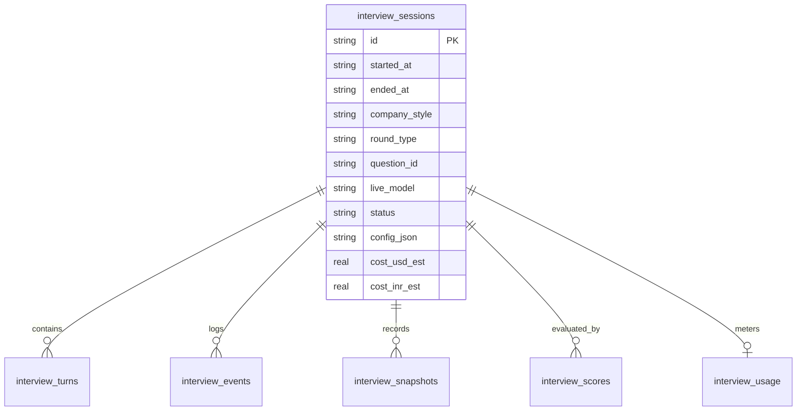

# ADR-002: Storage Architecture — SQLite / Neon Schema & Local Markdown Dual Persistence

## Status
Accepted

## Context
The Mock-Interview module produces rich relational and time-series data:
- Session metadata (start/end, role, question, company style, status)
- Audio transcription turns (speaker, text, timestamp offsets)
- Temporal system events (code/diagram snapshots, observer evaluations, interjections, hints)
- Code and diagram snapshots (content hashes, code texts, diagram digests)
- Structured rubric scores and qualitative feedback
- Granular token usage (input audio, output audio, text in, text out, cost estimates)

The project currently uses **SQLite via Drizzle (`better-sqlite3`)** as its active local database (`data/job_appy.db`), with an existing frozen Neon/Postgres schema definition (`lib/schema.ts`). Markdown reports and JSON fixtures are also stored under `data/`.

## Decision
We adopt a **Dual-Persistence Pattern**:
1. **Relational Database Store (Primary):**
   - We define the interview tables in Drizzle SQLite schema (`lib/db/schema.ts`) and create matching table initializers in `lib/db/index.ts`:
     - `interview_sessions`
     - `interview_turns`
     - `interview_events`
     - `interview_snapshots`
     - `interview_scores`
     - `interview_usage`
   - We also provide corresponding PostgreSQL schema definitions in `lib/schema.ts` for Neon compatibility.
2. **Local Markdown Session Dossier (Export/Inspection):**
   - At session completion, a self-contained markdown report is generated under `data/interviews/<date>-<session_id>.md`.
   - The markdown report includes: full session metadata, rubric scores, evidence quotes, top weaknesses, recommended drills, and complete chronologically formatted transcripts.

### Data Privacy & Local-Only Flag:
- **Flag Notice:** Transcripts and code/diagram snapshots contain personal candidate answers and problem-solving data. If Neon (cloud Postgres) is activated, this conversational data will be stored off-machine.
- **Default Resolution:** By default, all interview data lives exclusively in local SQLite (`data/job_appy.db`) and local files (`data/interviews/`). If the user configures `DATABASE_URL` for Neon synchronization, transcripts will sync to Neon unless an explicit local-only flag (`INTERVIEW_STORAGE_LOCAL_ONLY=true`) is set in `.env.local`.

## Schema Entity Relationship

## Consequences
- Fast querying for history, metrics, and cockpit progress tracking directly from SQLite.
- Fully portable markdown reports can be audited, reviewed, or backed up independently of the database.
- Safe local-first guarantees preserve candidate privacy.
