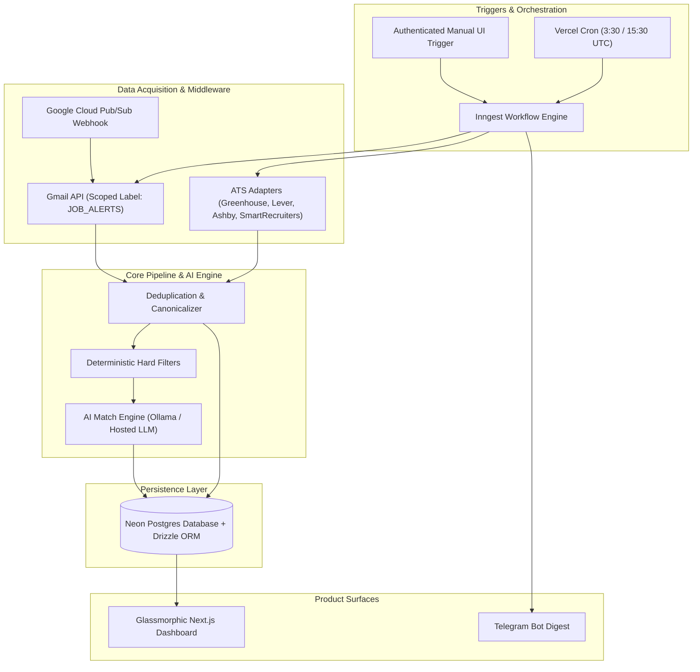

# Comprehensive Master PRD: Job Discovery & Application Portal

**Document Version:** 2.0 (Unified Master Specification)  
**Date:** 2026-07-28  
**Design Theme:** Elite Glassmorphism & Ultra-Rounded Aesthetics  
**Target Platform:** Next.js 14+ / TypeScript / Neon Postgres / Inngest / Telegram Bot  

---

## 1. Executive Summary & Product Vision

The **Job Discovery Portal** is a personal, automated, high-precision job intelligence system designed for a senior software engineering candidate (~9+ years experience in distributed systems, backend, SaaS, cloud infrastructure, and AI workflow automation). 

The portal autonomously aggregates, filters, ranks, and alerts on senior technical roles across verified employer ATS feeds and job-board email alerts—completely avoiding fragile or illegal web scraping.

### Key Value Propositions
- **Zero-Noise Intelligence:** Automated ingestion from direct ATS feeds (Greenhouse, Lever, Ashby, SmartRecruiters) and dedicated Gmail job alert labels (LinkedIn, Wellfound, etc.).
- **Deterministic & Semantic AI Scoring:** Hybrid matching engine evaluating candidates on a 0–100 scale with explicit, audit-backed rationale.
- **Elite Glassmorphic Surface:** A futuristic visual surface utilizing frosted glass panels (`backdrop-filter`), neon ambient backlighting, dynamic 3D tilt micro-interactions, and ultra-rounded corners (`border-radius: 24px`).
- **Automated Messaging & Digest:** Multi-channel reporting via one-click Telegram digests and deep-dive dashboard drawers.

---

## 2. Glassmorphism & UI/UX Design System Specification

### 2.1 Visual Design System & Design Tokens
The UI is built on a dark, moody background void with floating translucent panels, vibrant neon highlights, and soft curves.

```css
:root {
  /* Color Tokens */
  --bg-void-gradient: radial-gradient(circle at 50% 0%, #1A1025 0%, #0B0F19 100%);
  --glass-surface-bg: rgba(18, 24, 38, 0.55);
  --glass-surface-border: 1px solid rgba(255, 255, 255, 0.08);
  --glass-surface-hover-border: 1px solid rgba(0, 240, 255, 0.3);
  
  /* Neon Accents */
  --neon-cyan: #00F0FF;
  --neon-magenta: #FF007A;
  --neon-purple: #9D00FF;
  --neon-emerald: #00FF85;
  
  /* Glass Effects */
  --glass-blur-sm: blur(12px);
  --glass-blur-md: blur(20px);
  --glass-blur-lg: blur(32px);
  --glass-shadow: 0 20px 50px rgba(0, 0, 0, 0.5);
  --neon-glow-cyan: 0 0 20px rgba(0, 240, 255, 0.35);
  --neon-glow-magenta: 0 0 20px rgba(255, 0, 122, 0.35);

  /* Border Radii */
  --radius-xs: 8px;
  --radius-sm: 14px;
  --radius-md: 20px;
  --radius-lg: 28px;
  --radius-full: 9999px;

  /* Typography */
  --font-sans: 'Inter', system-ui, sans-serif;
  --font-mono: 'JetBrains Mono', monospace;
}
```

### 2.2 Layout & Structural Architecture (Bento Box)
- **Frosted Glass Navigation Sidebar:** Fixed left panel (`width: 260px`, `border-radius: 28px`), featuring translucent menu items, neon active-indicator pills, and manual scan triggers.
- **Floating Bento Grid Content Area:** The main canvas contains decoupled, floating rounded glass containers for dashboard metrics, job feed cards, and health diagnostics.
- **Sliding Glass Drawer (Right Side):** Deep-dive job details and AI evidence slide out from the right (`width: 520px`, `backdrop-filter: blur(32px)`). The main content behind is blurred and pushed slightly backward in 3D perspective (`transform: scale(0.98)`).

### 2.3 Key Micro-Interactions & Components
1. **Interactive 3D Parallax Job Cards:**
   - Soft rounded edges (`border-radius: 24px`).
   - Dynamic 3D tilt tracking the mouse cursor angle.
   - Radial cursor-following neon border glow spotlight (`radial-gradient` mapped to `(x, y)` relative mouse coordinates).
2. **AI Match Score Progress Ring:**
   - Circular SVG progress ring with gradient stroke (`#00F0FF` -> `#9D00FF` -> `#FF007A`).
   - Inner center text displaying the glowing numerical score (e.g. `94/100`) formatted in `JetBrains Mono`.
3. **Card-List Tables (Employer Watchlist & Run History):**
   - Each row is rendered as an isolated, pill-shaped horizontal glass card (`border-radius: 16px`) with generous padding and hover illumination.

---

## 3. End-to-End System Architecture



---

## 4. Authentication, Middleware & Security

### 4.1 Access Control & Auth Middleware
- **Dashboard Authentication:** NextAuth.js / Auth.js with Google OAuth restricted exclusively to pre-whitelisted candidate email addresses.
- **Middleware API Protection:** Edge middleware (`middleware.ts`) intercepting all `/api/*` and dashboard routes. Unauthenticated requests are redirected or receive `401 Unauthorized`.
- **Manual Scan Guard:** `/api/scans/trigger` requires a valid session token AND a CSRF nonce.

### 4.2 Security & Secret Governance
- **Zero Secrets in Code:** All database connection strings, OAuth client secrets, API keys, and Telegram tokens reside in environment variables (`.env.local` / Vercel Environment Storage).
- **Gmail Label Scope Isolation:** Google OAuth requests the minimal scope `https://www.googleapis.com/auth/gmail.readonly`. The sync service strictly queries messages tagged under the `JOB_ALERTS` label.
- **Token Encryption:** OAuth refresh tokens stored in Neon Postgres are encrypted at rest using AES-256-GCM.

---

## 5. Database Schema & Persistence (Neon Postgres + Drizzle ORM)

### 5.1 Data Model Summary
The persistence layer manages relational entities with idempotent upsert keys:

```typescript
// Core schema overview
export const companies = pgTable('companies', {
  id: uuid('id').primaryKey().defaultRandom(),
  name: text('name').notNull(),
  websiteUrl: text('website_url'),
  priority: integer('priority').default(1),
  isApproved: boolean('is_approved').default(false),
  createdAt: timestamp('created_at').defaultNow(),
});

export const sourceConfigs = pgTable('source_configs', {
  id: uuid('id').primaryKey().defaultRandom(),
  companyId: uuid('company_id').references(() => companies.id), // Nullable for aggregator RSS feeds (e.g. We Work Remotely)
  adapterType: text('adapter_type').notNull(), // 'greenhouse' | 'lever' | 'ashby' | 'smartrecruiters' | 'gmail' | 'rss'
  endpointUrl: text('endpoint_url').notNull(),
  rateLimitMs: integer('rate_limit_ms').default(1000),
  isActive: boolean('is_active').default(true),
});

export const jobs = pgTable('jobs', {
  id: uuid('id').primaryKey().defaultRandom(),
  canonicalUrl: text('canonical_url').notNull().unique(),
  companyName: text('company_name').notNull(),
  title: text('title').notNull(),
  location: text('location').notNull(),
  description: text('description').notNull(),
  salaryMin: integer('salary_min'),
  salaryMax: integer('salary_max'),
  currency: text('currency'),
  salaryStated: boolean('salary_stated').default(false),
  isRemote: boolean('is_remote').default(false),
  status: text('status').default('open'), // 'open' | 'closed' | 'possible_duplicate'
  firstSeenAt: timestamp('first_seen_at').defaultNow(),
  lastSeenAt: timestamp('last_seen_at').defaultNow(),
});

export const jobEvaluations = pgTable('job_evaluations', {
  id: uuid('id').primaryKey().defaultRandom(),
  jobId: uuid('job_id').references(() => jobs.id),
  score: integer('score').notNull(), // 0 - 100
  confidence: numeric('confidence', { precision: 3, scale: 2 }),
  sponsorshipStatus: text('sponsorship_status').notNull(), // 'explicit' | 'possible' | 'unconfirmed'
  matchReason: text('match_reason').notNull(),
  evidenceJson: jsonb('evidence_json').notNull(),
  provider: text('provider').notNull(), // 'ollama' | 'openai' | 'anthropic'
  evaluatedAt: timestamp('evaluated_at').defaultNow(),
});

export const scanRuns = pgTable('scan_runs', {
  id: uuid('id').primaryKey().defaultRandom(),
  triggerType: text('trigger_type').notNull(), // 'cron' | 'manual'
  status: text('status').notNull(), // 'running' | 'completed' | 'partial_failure' | 'failed'
  totalJobsFound: integer('total_jobs_found').default(0),
  newQualifyingJobs: integer('new_qualifying_jobs').default(0),
  startedAt: timestamp('started_at').defaultNow(),
  completedAt: timestamp('completed_at'),
});
```

---

## 6. Data Acquisition & Middleware Adapters

### 6.1 ATS Adapters
The portal implements polite, structured HTTP adapters for direct ATS feeds:
- **Greenhouse Adapter:** Queries public JSON endpoint (`boards-api.greenhouse.io/v1/boards/{board_token}/jobs?content=true`).
- **Lever Adapter:** Queries JSON feed (`api.lever.co/v0/postings/{company}?mode=json`).
- **Ashby Adapter:** Queries Ashby public job board API (`api.ashbyhq.com/posting-api/job-board/{company}`).
- **SmartRecruiters Adapter:** Queries company posting API (`api.smartrecruiters.com/v1/companies/{company}/postings`).

### 6.2 Gmail Job Alert Ingestion
- Reads incoming email alerts from LinkedIn, Wellfound, etc. via Gmail API.
- HTML content is parsed using `cheerio` / custom regex parsers to extract candidate job links.
- Parsing failures are routed to an **Unparseable Queue** in the dashboard.

---

## 7. AI Semantic Matching & Hybrid Evaluation Engine

### 7.1 Hard Deterministic Filters
Prior to calling the AI evaluation model, hard filters exclude non-matching roles:
- **Seniority Exclusion:** Rejects titles containing `Junior`, `Intern`, `Graduate`, `Entry Level`, or `Frontend Only`.
- **Location Rule:** Retains India-eligible, Worldwide Remote, or explicitly sponsored Japan/South Korea roles.

### 7.2 AI Rubric & Scoring Thresholds
Score scale **0–100**:
- **70 – 100 (Digest Fit):** High priority. Dispatched in the Telegram notification digest and featured in the primary Dashboard feed.
- **55 – 69 (Review Queue):** Secondary priority. Placed in the Dashboard Review Queue for manual candidate inspection.
- **< 55 (Filtered):** Retained in historical database for audit/deduplication, hidden by default.

---

## 8. Background Jobs, Triggers & Messaging

### 8.1 Scheduling & Workflow Execution
- **Cron Trigger:** Scheduled via Vercel Cron at `30 3 * * *` and `30 15 * * *` (9:00 AM & 9:00 PM IST).
- **Orchestration:** Triggers an **Inngest** workflow function (`job.scan.run`), which manages concurrency locks, parallel adapter retries, rate limits, and failure handling.

### 8.2 Telegram Messaging Bot Digest
Following every scan execution, a single formatted markdown message is sent via Telegram Bot API containing:
- **Run Summary:** Scan time, status, source health summary, and new qualifying roles count.
- **Strict Freshness:** Contains only roles first discovered (`first_seen_at`) during the current scan run (within the 24h / 2-scan window). Previously alerted roles are omitted.
- **Zero-New-Roles Notification:** If 0 new qualifying roles are found during a scan, Telegram receives a compact health summary confirming system execution and source health.
- **Individual Cards:** Top fits (Title, Company, Location, Match Score, Salary/Sponsorship status, direct link).
- **Idempotency Key:** Attached to `alert_deliveries` to guarantee zero double-alerts.

---

## 9. Implementation Milestones

| Milestone | Deliverables | Target Date |
| --- | --- | --- |
| **M1: Foundation & Auth** | Next.js setup, Tailwind/Vanilla Glass System, Middleware Auth, Neon Postgres migrations. | Week 1 |
| **M2: Data Adapters & Ingestion** | Greenhouse, Lever, Ashby, SmartRecruiters adapters + Gmail API ingestion pipeline. | Week 3 |
| **M3: Matching Engine & AI** | Deterministic filters, Ollama/Hosted LLM evaluation integration, scoring thresholds. | Week 3 |
| **M4: Glassmorphic UI & Surfaces** | Bento Box Dashboard, 3D Parallax cards, Progress score rings, Side drawer, Telegram Bot alerts. | Week 4 |
| **M5: Verification & Launch** | End-to-end integration tests, rate-limiting audit, cron rollout. | Week 5 |

---
